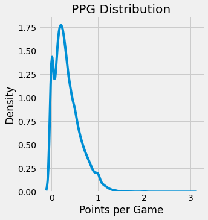
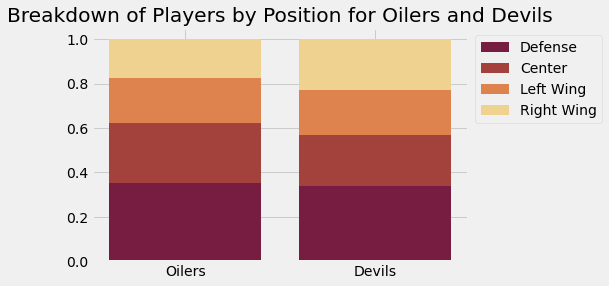
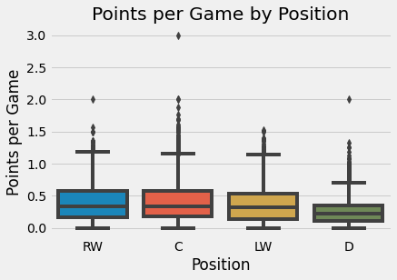

**Data Viz Beauty** - someone who is loved not only for their data viz skills, but for their personality. Overall cool person and usually has great stories. Might also have great flow.  

## Cheat Sheets 
- [Matplotlib gallery](https://matplotlib.org/stable/gallery/)
- [Python Visualization Gallery](https://www.python-graph-gallery.com/)


```python
import pandas as pd 
import matplotlib.pyplot as plt 
import seaborn as sns 
import numpy as np
```


```python
# load in data 
df = pd.read_csv('nhl.csv')
df.head()
```


<div>
<style scoped>
    .dataframe tbody tr th:only-of-type {
        vertical-align: middle;
    }

    .dataframe tbody tr th {
        vertical-align: top;
    }

    .dataframe thead th {
        text-align: right;
    }
</style>
<table border="1" class="dataframe">
  <thead>
    <tr style="text-align: right;">
      <th></th>
      <th>player</th>
      <th>team</th>
      <th>gp</th>
      <th>g</th>
      <th>a</th>
      <th>tp</th>
      <th>ppg</th>
      <th>pim</th>
      <th>+/-</th>
      <th>link</th>
      <th>season</th>
      <th>league</th>
      <th>playername</th>
      <th>position</th>
    </tr>
  </thead>
  <tbody>
    <tr>
      <th>0</th>
      <td>Jaromír Jágr (RW)</td>
      <td>Pittsburgh Penguins</td>
      <td>81</td>
      <td>52</td>
      <td>69</td>
      <td>121</td>
      <td>1.49</td>
      <td>42</td>
      <td>19.0</td>
      <td>https://www.eliteprospects.com/player/8627/jar...</td>
      <td>2000</td>
      <td>nhl</td>
      <td>Jaromír Jágr</td>
      <td>RW</td>
    </tr>
    <tr>
      <th>1</th>
      <td>Joe Sakic (C)</td>
      <td>Colorado Avalanche</td>
      <td>82</td>
      <td>54</td>
      <td>64</td>
      <td>118</td>
      <td>1.44</td>
      <td>30</td>
      <td>45.0</td>
      <td>https://www.eliteprospects.com/player/8862/joe...</td>
      <td>2000</td>
      <td>nhl</td>
      <td>Joe Sakic</td>
      <td>C</td>
    </tr>
    <tr>
      <th>2</th>
      <td>Patrik Elias (LW)</td>
      <td>New Jersey Devils</td>
      <td>82</td>
      <td>40</td>
      <td>56</td>
      <td>96</td>
      <td>1.17</td>
      <td>51</td>
      <td>45.0</td>
      <td>https://www.eliteprospects.com/player/8698/pat...</td>
      <td>2000</td>
      <td>nhl</td>
      <td>Patrik Elias</td>
      <td>LW</td>
    </tr>
    <tr>
      <th>3</th>
      <td>Alexei Kovalev (RW)</td>
      <td>Pittsburgh Penguins</td>
      <td>79</td>
      <td>44</td>
      <td>51</td>
      <td>95</td>
      <td>1.20</td>
      <td>96</td>
      <td>12.0</td>
      <td>https://www.eliteprospects.com/player/8670/ale...</td>
      <td>2000</td>
      <td>nhl</td>
      <td>Alexei Kovalev</td>
      <td>RW</td>
    </tr>
    <tr>
      <th>4</th>
      <td>Jason Allison (C)</td>
      <td>Boston Bruins</td>
      <td>82</td>
      <td>36</td>
      <td>59</td>
      <td>95</td>
      <td>1.16</td>
      <td>85</td>
      <td>-8.0</td>
      <td>https://www.eliteprospects.com/player/9064/jas...</td>
      <td>2000</td>
      <td>nhl</td>
      <td>Jason Allison</td>
      <td>C</td>
    </tr>
  </tbody>
</table>
</div>


```python
# list all available matplotlib styles 
plt.style.available
```


    ['Solarize_Light2',
     '_classic_test_patch',
     'bmh',
     'classic',
     'dark_background',
     'fast',
     'fivethirtyeight',
     'ggplot',
     'grayscale',
     'seaborn',
     'seaborn-bright',
     'seaborn-colorblind',
     'seaborn-dark',
     'seaborn-dark-palette',
     'seaborn-darkgrid',
     'seaborn-deep',
     'seaborn-muted',
     'seaborn-notebook',
     'seaborn-paper',
     'seaborn-pastel',
     'seaborn-poster',
     'seaborn-talk',
     'seaborn-ticks',
     'seaborn-white',
     'seaborn-whitegrid',
     'tableau-colorblind10']


```python
# use fivethirtyeight
plt.style.use('fivethirtyeight')
```

### Categorical Data - 1 Feature


```python
# visualize number of players at each position
# since categorical I will use a count plot 

df['position'].value_counts().plot(kind = 'bar', figsize = (10, 6))
plt.xticks(rotation = 0)
plt.xlabel('Position')
plt.ylabel('Number of Players')
plt.title('Number of Players by Position');
```


    

    


**Bonus: Add counts to bar plot**


```python
df['position'].value_counts().plot(kind = 'bar', figsize = (10, 6))
plt.xticks(rotation = 0)
plt.xlabel('Position')
plt.ylabel('Number of Players')
plt.title('Number of Players by Position');
vals = list(df['position'].value_counts().values)
for i in range(len(vals)):
    plt.text(i, vals[i], vals[i], ha = 'center', fontsize = 12)
```


    

    


```python
# We can also plot the percentages instead of the raw numbers 
ax = df['position'].value_counts(normalize = True).plot(kind = 'bar', figsize = (10, 6))
# make y axis a percentage 
vals = ax.get_yticks()
ax.set_yticklabels(['{:,.0%}'.format(x) for x in vals])
plt.xticks(rotation = 0)
plt.xlabel('Position')
plt.ylabel('Number of Players')
plt.title('Number of Players by Position');
```

    /var/folders/fz/lqw0sxh148gfqcgkqm8cqhqr0000gn/T/ipykernel_28094/2089188846.py:5: UserWarning: FixedFormatter should only be used together with FixedLocator
      ax.set_yticklabels(['{:,.0%}'.format(x) for x in vals])


    

    


> This means that roughly 35% of players in the NHL play Defense 

### Continuous Data - 1 Feature

Lets look at the distribution of PPG 
> Note for Barb: PPG (points per game) is defined as: $$ \frac{total\;points}{games\;played} $$


```python
# start with histogram 
sns.histplot(df['ppg'])
plt.xlabel('Points per Game')
plt.title('PPG Distribution');
# most players have a PPG of less than 0.5 and there are some outliers with high PPG
```


    

    


```python
# can also use a density plot 
sns.displot(df['ppg'], kind = 'kde')
plt.xlabel('Points per Game')
plt.title('PPG Distribution');
# this smooths out the distribution 
```


    

    


```python
# boxplot 
sns.boxplot(x = df['ppg'])
plt.xlabel('Points per Game')
plt.title('PPG Distribution');
```


    

    


### Categorical and Categorical Data - 2 Features 


```python
# plot count of player position by team for Edmonton Oilers and New Jersey Devils 
# stacked bar chart 
oilers = df[df['team'] == 'Edmonton Oilers']['position'].value_counts(normalize = True)
devils = df[df['team'] == 'New Jersey Devils']['position'].value_counts(normalize = True)

# make arrays with percentage for each position
defense = np.array([oilers['D'], devils['D']])
center = np.array([oilers['C'], devils['C']])
left_wing = np.array([oilers['LW'], devils['LW']])
right_wing = np.array([oilers['RW'], devils['RW']])

# add defense
plt.bar(range(2), defense, color = '#781D42', label = 'Defense')
# add center
plt.bar(range(2), center, color = '#A3423C', label = 'Center', bottom = defense)
# add left wing
plt.bar(range(2), left_wing, color = '#DE834D', label = 'Left Wing', bottom = defense + center)
# add right wing
plt.bar(range(2), right_wing, color = '#F0D290', label = 'Right Wing', bottom = defense + center + left_wing)

plt.xticks(range(2), ['Oilers', 'Devils'])

plt.legend(loc='upper left', bbox_to_anchor=(1,1), ncol=1)
plt.title('Breakdown of Players by Position for Oilers and Devils');

# We see the Oilers used a greater proporation of Centers and the Devils used a greater proporation of Right Wings
```


    

    


### Continuous and Categorical Data - 2 Features 


```python
# plot ppg (continuous) vs position (categorical )
# box plot 
sns.boxplot(x = 'position', y = 'ppg', data = df)
plt.xlabel('Position')
plt.ylabel('Points per Game')
plt.title('Points per Game by Position');

# We can see the RW, C and LW have higher PPG than D 
```


    

    


```python
# bar plot with average 
df.groupby('position')['ppg'].mean().plot(kind = 'bar')
plt.xticks(rotation = 0)
plt.xlabel('Position')
plt.ylabel('Points per Game')
plt.title('Average Points per Game by Position');
```


    

    


### Continuous and Continous Data - 2 Features 

Plot goals (continuous) vs total points 

> Note for Barb: Total Points is defined as $$goals + assists$$


```python
# plot goals (continuous) vs total points (continuous)

# scatter plot 
df.plot.scatter(x = 'g', y = 'tp')
plt.xlabel('Goals')
plt.ylabel('Total Points')
plt.title('Goals vs Total Points');

# we see a strong positive correlation between goals and total points
```


    

    


### Time Series - Features 


```python
# total players by season 

# line plot 
df['season'].value_counts().sort_index().plot(kind = 'line')
plt.xlabel('Season')
plt.ylabel('Total Players')
plt.title('Total Players by Season');
```


    

    


```python
# average ppg by season 
df.groupby('season')['ppg'].mean().plot(kind = 'line')
plt.xlabel('Season')
plt.ylabel('Points per Game')
plt.title('Average Points per Game by Season');
```


    

    


## Bonus 

### Waffle Charts 


```python
!pip install pywaffle
```

    Requirement already satisfied: pywaffle in /Users/jeffreyherman/opt/anaconda3/lib/python3.9/site-packages (0.6.4)
    Requirement already satisfied: matplotlib in /Users/jeffreyherman/opt/anaconda3/lib/python3.9/site-packages (from pywaffle) (3.4.3)
    Requirement already satisfied: pillow>=6.2.0 in /Users/jeffreyherman/opt/anaconda3/lib/python3.9/site-packages (from matplotlib->pywaffle) (8.4.0)
    Requirement already satisfied: numpy>=1.16 in /Users/jeffreyherman/opt/anaconda3/lib/python3.9/site-packages (from matplotlib->pywaffle) (1.20.3)
    Requirement already satisfied: python-dateutil>=2.7 in /Users/jeffreyherman/opt/anaconda3/lib/python3.9/site-packages (from matplotlib->pywaffle) (2.8.2)
    Requirement already satisfied: pyparsing>=2.2.1 in /Users/jeffreyherman/opt/anaconda3/lib/python3.9/site-packages (from matplotlib->pywaffle) (3.0.4)
    Requirement already satisfied: kiwisolver>=1.0.1 in /Users/jeffreyherman/opt/anaconda3/lib/python3.9/site-packages (from matplotlib->pywaffle) (1.3.1)
    Requirement already satisfied: cycler>=0.10 in /Users/jeffreyherman/opt/anaconda3/lib/python3.9/site-packages (from matplotlib->pywaffle) (0.10.0)
    Requirement already satisfied: six in /Users/jeffreyherman/opt/anaconda3/lib/python3.9/site-packages (from cycler>=0.10->matplotlib->pywaffle) (1.16.0)


```python
from pywaffle import Waffle

# plot distribution of player position using Waffle Chart
data = df['position'].value_counts(normalize = True).mul(100).to_dict()
fig = plt.figure(
    FigureClass=Waffle,
    title={'label': 'Distribution of Player Position', 'loc': 'left'},
    rows=5, 
    values=data, 
    labels=[f"{k} ({int(v)}%)" for k, v in data.items()],
    legend={'loc': 'lower left', 'bbox_to_anchor': (0, -0.4), 'ncol': len(data), 'framealpha': 0},
    figsize = (8, 4)
)
plt.show()
```


    

    

